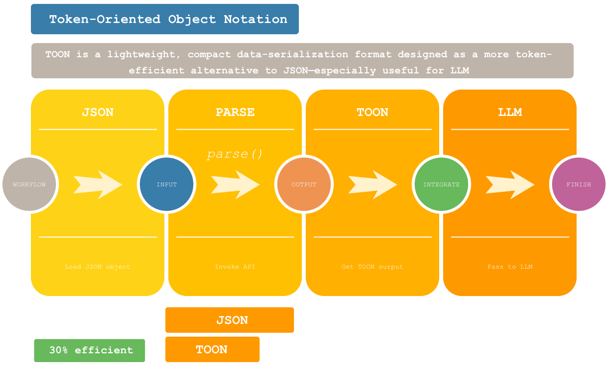

# ToonParser Libray (for Token-Oriented Object Notation (TOON))



# Token-Oriented Object Notation (TOON)

TOON (often described as Token-Optimized Object Notation) is a lightweight, compact data-serialization format designed
as a more token-efficient alternative to JSON—especially useful for LLM prompts, configs, or low-bandwidth storage.

# ToonParser

This is a new Java-based library identified as `ToonParser` to convert the JSON into TOON by following the specifications:
https://toonformat.dev/guide/getting-started.html

# Why this library?

- It uses Java's built-in data-structures (`Map` & `Collections`) to convert a JSON to TOON.
- No external component dependencies needed to load this library into your code.
- Advantages:
    - Performance efficient.
    - Light-weight.
    - Uses Collection framework.
    - No transitive dependencies on JSON based libraries like (like Jackson & GSON).

# How to use the API:

- Below is the code sample code to invoke `ToonParser` library by passing a jsonObject to `toon.parse` method which 
return a list of toon String.

```java
import com.toonparser.api.Toon;

public class Main {
    public static void main(String[] args) {
        //jsonObject can be obtained from sources like file, POJO, Rest API, etc
        Toon toon = new Toon();
        List<?> toonObject = toon.parse(jsonObject);
    }
}
```

> [!TIP]
> The TOON format is stable, but also an idea in progress. Thus, this library will also evolve further &
> we invite open-source community to shape where it goes further by contributing to this repo or sharing feedback.

# Code Sample

- Converting a `single-line.json`
```json
[
  "EN",
  "TH",
  "HIN",
  "JPY"
]
```
to `single-line.toon`

```
[4]: EN,TH,HIN,JPY
```

- Converting a `flat.json`
```json
[
  {
    "id": 1,
    "name": "Alice",
    "age": 25,
    "city": "New York"
  },
  {
    "id": 2,
    "name": "Bob",
    "age": 30,
    "city": "Los Angeles"
  }
]
```
to `flat.toon`

```TOON
[2]{id,name,age,city}:
  1,Alice,25,New York
  2,Bob,30,Los Angeles
```

- Converting a `nested.json`

```json
[
  {
    "company": "TechCorp d1",
    "location": "San Francisco",
    "departments": [
      {
        "name": "Engineering d2",
        "employees": [
          { "name": "John d3", "role": "Developer" },
          { "name": "Jane", "role": "Tester" }
        ]
      }
    ]
  },
  {
    "company": "BizSolutions",
    "location": "Chicago",
    "departments": [
      {
        "name": "Marketing",
        "employees": [
          { "name": "Tom", "role": "Manager" },
          { "name": "Lucy", "role": "Executive" }
        ]
      }
    ]
  }
]
```
to `nested.toon`

```TOON
[2]:
  - company: TechCorp d1
    location: San Francisco
    departments[1]:
      - name: Engineering d2
        employees[2]{name,role}:
          John d3,Developer
          Jane,Tester
  - company: BizSolutions
    location: Chicago
    departments[1]:
      - name: Marketing
        employees[2]{name,role}:
          Tom,Manager
          Lucy,Executive
```

## License

[MIT](./LICENSE) License © 2025-PRESENT [Parth Kansara](https://github.com/kparth01)
